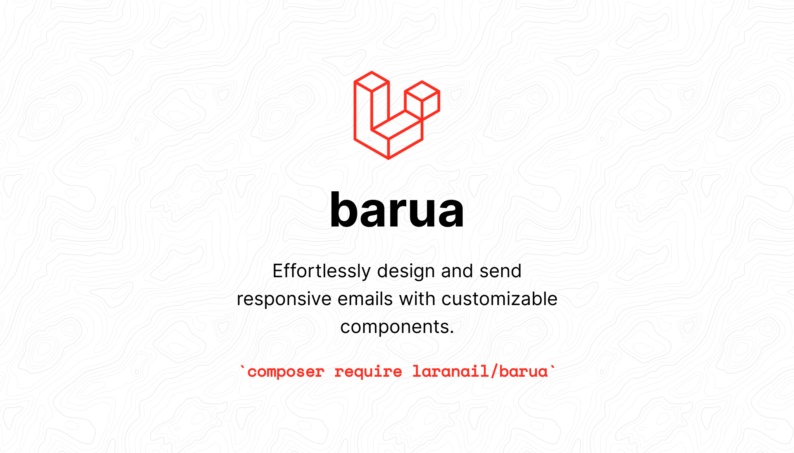
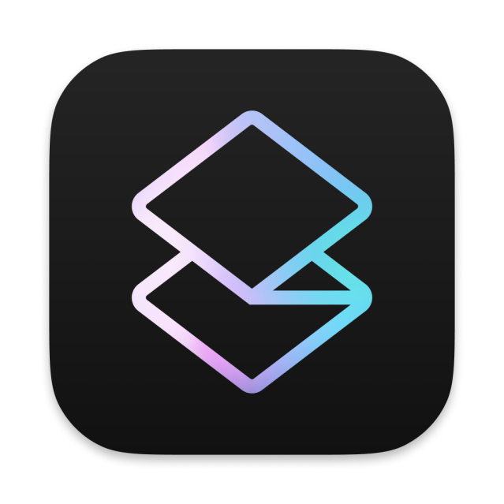

<style>
    .banner-image {
        width: 100%; /* Full-width */
        height: auto; /* Maintain aspect ratio */
        border-radius: 8px; /* Rounded corners */
        margin: 10px auto;
    }
</style>

<div align="center">
   
   <br />
</div>

<div align="center">
   <strong>Barua</strong>
</div>
<div align="center">
<p>
The next generation of writing emails.<br />High-quality, un-styled components for creating emails.</p>
</div>
<div align="center">
   <a href="https://simtabi.com">Website</a> 
   <span> · </span>
   <a href="https://github.com/laranail/barua">GitHub</a> 
   <span> · </span>
   <a href="https://simtabi.com/discord">Discord</a>
</div>


<hr>

# Table of Contents
1. [Introduction](#introduction)
2. [Getting Started](#getting-started)
   - [Prerequisites](#prerequisites)
   - [Installation](#installation-and-configuration)
3. [Email Components](docs/email-components.md)
5. [Contributing](CONTRIBUTING.md)
6. [License](LICENSE.md)
6. [Changelog](CHANGELOG.md)
7. [Support and Community](SUPPORT.md)

<br>
<hr>


## Introduction

The purpose of this package is to offer convenient mechanisms for creating and sending responsive and visually appealing emails. It includes un-styled components at its core, allowing for more tailored and personalized design customization.

---

## Getting Started

This section will walk you through the initial setup and basic usage of this package, ensuring you can quickly begin creating and sending responsive emails with the available fluent API and customizable components.

---

## Prerequisites

Before installing this package, make sure that your system meets the following requirements:

- PHP >= 8.2 (or newer) installed on your system.
- Laravel 9.x or newer installed on your system.
- Composer for managing dependencies.

## Installation and Configuration

1. **Install the Package via Composer**

To install the package, run the following command in your Laravel project directory:

```bash
composer require --dev laranail/barua
```

2. **Publish package files (Optional)**

Run the following commands to publish the package assets, configuration, and template files to your Laravel application for further customization.

a. **Publish package Service Provider**
```bash
php artisan vendor:publish --provider=Simtabi\Laranail\Barua\Providers\BaruaServiceProvider // to publish the service provider
```

b. **Publish specific files using the following tags per your needs:**
```php
php artisan vendor:publish --tag=barua::blade-component-classes     // to copy blade component classes            
php artisan vendor:publish --tag=barua::blade-components            // to copy blade components view files                         
php artisan vendor:publish --tag=barua::blade-templates             // to copy all blade template files                           
php artisan vendor:publish --tag=barua::config                      // to copy config files                                    
php artisan vendor:publish --tag=barua::lang                        // to copy lang files                      
php artisan vendor:publish --tag=barua::mail-template-classes       // to copy mail template classes to the default app/Mail directory                       
php artisan vendor:publish --tag=barua::public-assets               // to copy public assets files to the public directory
```

Alternatively, you can manually copy the files yourself to your Laravel application.

```bash
/config/* 
/database/*
/resources/assets/*
/resource/lang/*
/resources/views/*
/src/Mail/Templates/*
```

# Configuration
Optionally, add the following configuration options to change the package's default behavior:

1. **Environment Configuration**

```dotenv
# this option exposes the package's default routes for testing purposes
 BARUA_ENABLE_DEV_MODE=true
# this option enables the package to throw exceptions when errors occur
 BARUA_ENABLE_ERROR_THROWING=true
# this option sets the maximum file size for attachments
 BARUA_MAX_FILE_SIZE="5mb"
# this option sets the allowed MIME types for attachments
 BARUA_ALLOWED_MIME_TYPES="application/pdf,image/jpeg,image/png,"
```
2. **Package**
   You can publish the package configuration file located at `` config/barua.php `` to make changes to the default settings.

3. **Language**
   You can publish the package language file located at `` /resources/lang/en/barua.php `` to make changes to the default language values.

4. **Mail**
   The application will use the default Laravel mail configuration settings to send emails, as you have already set up in your Laravel application's environment file or as stored in the database.

```php
'from' => [
    'email' => env('MAIL_FROM_ADDRESS', 'hello@example.com'),
    'name'   => env('MAIL_FROM_NAME', 'Example'),
],
```
6. **View Templates &amp; Components**
   The package comes with a collection of Blade components that are un-styled by default, enabling you to design your email templates from scratch. If you prefer, you can also utilize your own pre-made HTML templates.

These Blade components, supplied by the package, are designed to be both responsive and customizable, facilitating the creation of attractive emails. These components can be employed to create a range of email templates, from straightforward text-based messages to more intricate layouts incorporating images and links.

You can find these components in the `resources/views/emails` or `resources/views/vendor/barua` directories once they've been published, and they can be easily tailored to meet your requirements.

You're encouraged to modify the provided templates/components to align with your specific needs, including any particular commands, configuration specifics, or features that should be made known to users from the outset.

---

## Compatibility
All blade components were tested and found to be compatible with the following email clients:

|  |  |  |  |  |  |
| -------------------------------------------------------------------------------------------------- | ------------------------------------------------------------------------------------------------------- | ------------------------------------------------------------------------------------------------------ | ------------------------------------------------------------------------------------------------------------- | ---------------------------------------------------------------------------------------------- | ------------------------------------------------------------------------------------------------------------ |
| Gmail ✔                                                                                           | Apple Mail ✔                                                                                           | Outlook ✔                                                                                             | Yahoo! Mail ✔                                                                                                | HEY ✔                                                                                         | Superhuman ✔                                                                                                |

## Development

#### Install dependencies

```bash
composer install
```

#### Tests
```sh
composer ci
```

## Authors

- Imani ([@imanimanyara](https://twitter.com/imanimanyara))

## License & Copyright

Made with ❤️ by [Simtabi](https://simtabi.com). Open-sourced software licensed under the MIT license.
