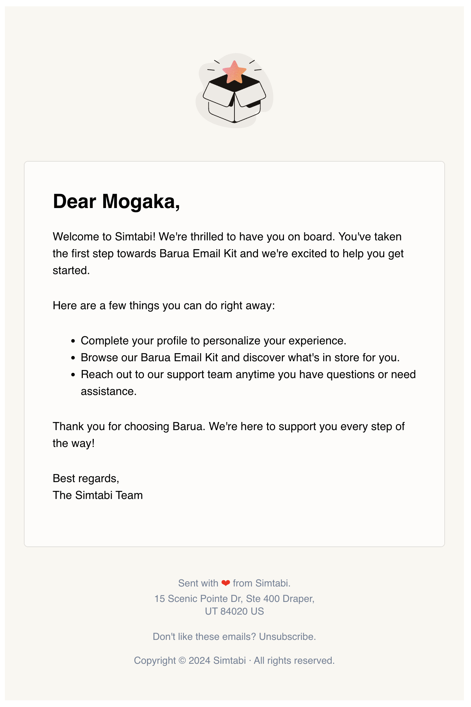

## Usage
Here's a simple example of how to construct and dispatch an email using the package:


#### To send a message using the already provided "Welcome Message" template
From your controller simply call the mailable as you normally would. You can also send some optional
variables as an array.

## Option 1:
Using the default Laravel Mail, and the Barua Service to build the email components using a fluent interface

```php
Mail::to($user)->send(new WelcomeUser(barua: $mailBuilder, user: $user, data: [
  'urls' => [
    'unsubscribe' => 'http://domain.com/unsubscribe',
    'play'        => 'http://domain.com/playstore',
    'ios'         => 'http://domain.com/iostore',
    'refer'       => 'http://domain.com/refe',
    'webview'     => 'http://domain.com/webview',
  ],
]));
```

## Option 2:
Using the Mail Service to build and send the email.

### Initialize the MailBuilder, MailSender classes and set required configurations

Get User Model that has been set in the config file, this can be customised to your needs
```php
// get user model
$user = Helpers::getUserModel();
/** @var Model|string $user */
$user = $user::first();
```

#### Initialize the MailBuilder, DataBuilder, ErrorBuilder classes and set required configurations

1. Fetch the configured User model as set in the config file
```php
// get user model
$user = Helpers::getUserModel();
/** @var Model|string $user */
$user = $user::first();
```

2. Initialize the MailBuilder, DataBuilder, ErrorBuilder classes and set required configurations
```php
// initialize the error builder class
$errorBuilder = new ErrorBuilder();

// initialize the data builder class
$dataBuilder  = new DataBuilder();
// initialize the mail builder class, and pass to it the error builder object
$mailBuilder  = new MailBuilder(errorBuilder: $errorBuilder);
```

3. Define email variables that will be used in the email template
```php
// they should be in the format [variable] and will be automatically replaced with the actual values
$dataBuilder->setVariables('[name], [email], [phone], [package],[price], [method],[note]');
```

4.  Define the sender's name and email address or use the default that you have set in the env file using the MAIL_FROM_ADDRESS and MAIL_FROM_NAME
```php
$mailBuilder->setSender(email: Helpers::getSender()->email, name: Helpers::getSender()->name);
```

5. Use the mail builder to set the email subject, recipient, cc, bcc, and other email configurations
```php
// set the email subject, if left empty, the default subject which is defined in the mailable class will be used. 
$mailBuilder->setSubject('Welcome to our platform');

// several ways of setting the recipient
$mailBuilder->setTo(email: $user->email, name: $user->name)
// or $mailBuilder->setTo(email: 'info@info.com', name: 'John Doe');
// or $mailBuilder->setTo(email: 'info@info.com', name: null);

// several ways of setting the bcc
$mailBuilder->setBcc(email: $user->email, name: $user->name)
// or $mailBuilder->setBcc(email: 'info@info.com', name: 'John Doe');
// or $mailBuilder->setBcc(email: 'info@info.com', name: null);

// several ways of setting the cc
$mailBuilder->setCc(email: $user->email, name: $user->name)
// or $mailBuilder->setCc(email: 'info@info.com', name: 'John Doe');
// or $mailBuilder->setCc(email: 'info@info.com', name: null);


// or through an array

// i.e
foreach($users as $user){

    // if $user is an object
    $email = $user->email;
    $name  = $user->name;

    // if $user is an array
    // $email = $user['email'];
    // $name  = $user['name'];
    
    // set the recipient types
    $mailBuilder->setTo(email: $email, name: $name);
    $mailBuilder->setBcc(email: $email, name: $name);
    $mailBuilder->setCc(email: $email, name: $name);
}
```

6. Set email data that will be used in the email template, the keys should match what you have defined the email variables in the [variable] format
```php

//set data to be used in the email template, the keys should match what you have defined the email variables in the [variable] format
$data   = [
    'serviceName' => 'Service Name',
    'brandName'   => 'Brand Name',
    'productName' => 'Product Name',
    'name'        => 'Name',
    'productOrService' => 'Product or Service',
    'solutionOrOffer'  => 'Solution or Offer',
    'unsubscribeLink'  => 'https://simtabi.com',
];
```

7. Initialize the Mailable (Email Template) class and pass the mail builder, data builder, and error builder objects
```php
$mailable = new WelcomeUser(
    mailBuilder: $mailBuilder,
    dataBuilder: $dataBuilder
    // Multiple data points can be passed to the mailable object
        ->setData(array_merge([
            'verification_link' => 'https://simtabi.com',
        ], $data))
        ->setData(['street' => '5th Ave', 'number' => '101'], 'user.details.address')
        ->setData(['phone' => '123-456-7890'], 'user.details.contact'),
    errorBuilder: $errorBuilder
);

$queued = false; // true if are we queuing the email. false if we are sending it immediately
$delay  = null;  // delay in seconds before the email is sent. accepts DateTimeInterface|DateInterval|Carbon|int|null

return (new MailSender(mailable: $mailable, mailBuilder: $mailBuilder, dataBuilder: $dataBuilder, errorBuilder: $errorBuilder))->sendEmail(queued: $queued, delay: $delay);
```

### Send the email
```php
$queued = false; // true if are we queuing the email. false if we are sending it immediately
$delay  = null;  // delay in seconds before the email is sent

return (new MailSender(mailable: $mailable, mailBuilder: $mailBuilder, dataBuilder: $dataBuilder, errorBuilder: $errorBuilder))->sendEmail(queued: $queued, delay: $delay);
```

## Debugging &amp; testing the emails
If you would like to preview the emails before using them, copy the contents of the
```/routes/web.php``` to your version. Remember to turn off the debug directive in the production environment.

Then open these URLS to view the template

* ```/yourdomain.com/barua/debug/welcome_user```
* ```/yourdomain.com/barua/debug/verify_email```
* ```/yourdomain.com/barua/debug/forgot_password```
* ```/yourdomain.com/barua/debug/payment_confirmation```

<br />

---


## Screenshots

<div align="left">
   
   <br />
</div>
